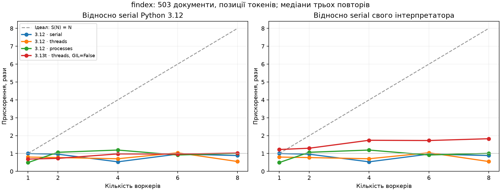

# findex — лабораторні роботи 1–6

[](https://github.com/lev1pes/lab-01/actions/workflows/ci.yml)

## Лабораторна 6: асинхронний краулер

Версія **0.6.0**, тег **lab-06**. `findex crawl` отримує дозволені HTML-сторінки, видає їх асинхронним генератором і записує JSONL у міру надходження. Далі окрема команда `findex index` читає JSONL ліниво, а пошук показує URL, назви й снипети.

### Дозвіл і відтворення

Для досліду використано **власне локальне дзеркало**, яке запускає `scripts/local_mirror.py` лише на `127.0.0.1`. Ми контролюємо сервер і його `robots.txt`: `User-agent: *`, `Disallow: /private`. Дозвіл походить від власника цього локального стенда; зовнішні сайти під час замірів не обходяться. Вміст — 199 текстів із уже наявного корпусу документації CPython 3.12.10 та сторінка-каталог. Тексти й результати обходу залишаються в ігнорованому `data/`.

User-Agent: `findex/0.6 (+https://github.com/lev1pes/lab-01/issues)`. Адреса Issues служить для зв'язку. Для іншого сайту перед запуском потрібен дозвіл на обхід; robots.txt перевіряється автоматично, маскування під браузер немає.

Перше вікно термінала:

```bash
uv sync --locked
# Лише якщо корпусу ще немає:
uv run python scripts/download_corpus.py
uv run python scripts/local_mirror.py
```

Друге вікно:

```bash
uv run findex crawl http://127.0.0.1:8766/ --max-pages 200 --concurrency 20 --per-host 5 --delay 0.005 --out data/crawl.jsonl --log data/crawl.log --debug
uv run findex index data/crawl.jsonl --out data/crawl-index.json --positions
uv run findex search data/crawl-index.json '"event loop"' --k 5
```

`crawl` показує Rich-таблицю: сторінки, сторінки/с, запити в польоті, помилки, глибина черги. Вона оновлюється кожні 0,1 с у терміналі; діагностика йде у stderr. За замовчуванням журнал — `crawl.log`, JSONL — `data/crawl.jsonl`. JSONL перезаписується, журнал дописується. Ctrl+C зупиняє обхід; уже записані рядки залишаються придатними для індексації. Для JSONL типовий виконавець індексації — `serial`; `--executor threads/processes` призначені для каталогів `.txt` лабораторної 5.

### Як влаштовано

- `fetch.py`: `asyncio.timeout` обмежує мережеву спробу; загалом **до трьох спроб**, тобто перша плюс максимум два повтори. Повтори лише для 429, 500–599 і таймаутів. 404/403 та інші транспортні помилки записуються без повтору. Пауза — `min(8, 0.25 * 2**attempt) + uniform(0, 0.25)`, не менша за `Retry-After` (секунди або HTTP-дата). Вона також стримує нові запити того самого origin.
- `RobotsCache`: один файл правил на `(scheme, host, port)` за обхід, спільний кеш і Lock для одночасного першого звернення. 404 дозволяє, 200 розбирається через `urllib.robotparser`; 401/403, недоступність або редірект robots.txt консервативно забороняють. `Crawl-delay`, якщо заданий цілим числом, збільшує нашу мінімальну паузу. Robots-запити теж проходять загальний і локальний ліміти.
- `crawl.py`: frontier — `asyncio.Queue`, воркери живуть у `TaskGroup`. Один Semaphore обмежує всі HTTP-спроби, окремий — origin; Lock захищає розклад стартів. За замовчуванням дозволені лише точні домени seed, без автоматичного дозволу піддоменів. Редіректи не виконуються клієнтом автоматично: адреса з Location знову проходить allowlist, seen і robots.
- Канонізація: нижній регістр схеми/хоста, видалення фрагмента і стандартного порту, сортування query зі збереженням повторних ключів/порожніх значень, видалення кінцевого слеша крім `/`. Для дзеркала це правильна еквівалентність; довільний сайт може відрізняти `/a` і `/a/`. Редірект до вже відомої канонічної адреси завершується без повторного запиту, тому такий slash-редірект може залишитися без документа.
- `HTMLParser` вилучає title, текст і посилання; script/style/noscript у пошук не потрапляють. Приймається HTTP 200 з HTML/XHTML. Сторінка обмежена 2 МіБ декодованого тіла, robots — 512 КіБ. Ліміт `max_pages * 20` на виявлені URL стримує нескінченні query; він може завершити обхід раніше цільового числа успішних сторінок.
- Черга результатів обмежена `concurrency`; у пам'яті немає списку всіх Page. Зберігаються seen, frontier і поточні відповіді. `max_pages` обмежує **видані сторінки**, а не кількість HTTP-спроб. На ліміті чи при закритті генератора воркери скасовуються, frontier очищається, клієнт закривається. Уже розпочаті запити можуть мати `status=cancelled`.
- `output.py`: JSON-серіалізація та запис/flush виконуються через `to_thread`; журнал — через `QueueHandler`/`QueueListener`. У JSONL поля `url`, `title`, `text`, `fetched_at` (UTC). `iter_documents` читає по рядку й повідомляє номер пошкодженого рядка. URL і title зберігаються в метаданих індексу.

### Замір на 200 сторінках

Windows, Intel Core i5-9400F, Python 3.12.5. Seed у всіх запусках — `http://127.0.0.1:8766/`, `max_pages=200`, `per_host=5`, `delay=0.005`, timeout 5 с. **Сервер штучно додає 80 мс очікування кожної відповіді**, включно з robots.txt. Це відтворювана модель I/O, не швидкість реального Інтернету. Сервер працює в іншому процесі від краулера й не входить у його RSS.

Три повтори на конфігурацію у свіжих процесах; порядок 1/5/20 чергується. Окремого прогріву немає: підготовка клієнта входить у wall. Wall охоплює обхід, повтор 429, читання відповідей, HTML, потоковий запис JSONL і закриття клієнта/журналу; імпорт скрипта та підготовка дзеркала поза таймером. Увімкнено `debug=True`, `tracemalloc` вимкнено. RSS — Windows PeakWorkingSetSize процесу, включно з його стартовою пам'яттю; це не лише Python-об'єкти.

| Concurrency | Сторінки | Wall, с | min–max, с | Стор./с | Помилки | Пік RSS, МіБ |
|---:|---:|---:|---:|---:|---:|---:|
| 1 | 200 | 22.241 | 22.237–23.105 | 8.99 | 1 | 40.29 |
| 5 | 200 | 6.527 | 6.489–6.566 | 30.64 | 1 | 41.42 |
| 20 | 200 | 6.886 | 6.838–7.482 | 29.04 | 1 | 42.86 |

Медіани обчислено окремо для кожної колонки. Помилки — неуспішні спроби: кожний запуск має одну навмисну 429, яка виправляється повтором. У кожному прогоні 202 HTTP-спроби: 200 успішних сторінок, robots.txt та повтор. Дев'ять наборів URL/title/text збігаються за SHA-256 (час завантаження не порівнюється): `364656ea6eab243218f1a44114f9ea2dde690357f79380d9b9ce180b417a93f4`.

Числа та окремі повтори: [lab06.json](benchmarks/lab06.json). [Повні журнали й stderr debug](benchmarks/lab06-logs). Відтворення (попередньо зупинити окремий сервер на порту 8766):

```bash
uv run python scripts/benchmark_crawler.py
```

Скрипт сам піднімає дзеркало, скидає контрольований збій перед кожним повтором і зупиняє сервер у finally. Систему не ізольовано від інших програм, тому дрібні різниці не варто узагальнювати.

### Що пояснюють результати

20 корутин дали **3.23×** відносно одного воркера, але не випередили п'ять. Це очікувана межа нашого стенда: один origin, максимум п'ять запитів у польоті, пауза між стартами та спільний Retry-After. Зайві воркери чекають семафор і додають трохи обслуговування. Ліміти залишено, бо вони захищають сервер від надмірної частоти запитів; нарощувати concurrency безмежно не має сенсу.

У лабі 5 основною роботою були CPU-обчислення, де процеси обходили спільний GIL. Тут HTTP-запити переважно чекають, а один event loop перекриває ці очікування без окремого OS-потоку чи процесу на кожний URL та без pickle кожної сторінки між процесами. Пул потоків теж здатен перекривати I/O; таблиця **не є прямим benchmark asyncio проти ThreadPool/ProcessPool**. Порівнювати ці секунди із секундaми індексації 503 документів як доказ переваги некоректно.

Якби `build_index()` викликався всередині корутини, токенізація й оновлення словників зайняли б потік циклу до повернення функції. Мережеві задачі й таймаути не отримали б своєчасного виконання. Тому індексація йде після обходу. Для конвеєра одночасної індексації знадобився б окремий ProcessPool через `run_in_executor`, але він тут не потрібен.

### Один збій і його виправлення

Справжні рядки [c20-r0.log](benchmarks/lab06-logs/c20-r0.log):

```text
2026-09-29 14:46:15,348 url=http://127.0.0.1:8766/doc/10 status=429 bytes=18 elapsed=0.1203 attempt=1 error=-
2026-09-29 14:46:15,348 url=http://127.0.0.1:8766/doc/10 retry_in=1.0000
2026-09-29 14:46:16,911 url=http://127.0.0.1:8766/doc/10 status=200 bytes=17542 elapsed=0.1131 attempt=2 error=-
```

Сервер попросив `Retry-After: 1`; друга спроба почалася не раніше секунди, а закінчилася успішно. Backoff і jitter використовуються, але в цьому випадку їхню меншу паузу перекриває Retry-After. Ніяких повторів 404 для «покращення» результатів немає.

### Перевірка блокування й тести

Перший пробний запуск справді знайшов блокування: 0,422 с при ініціалізації HTTPX/TLS і 0,172 с при першому завантаженні async backend. [Початковий debug](benchmarks/lab06-debug-before.txt) і [його запити](benchmarks/lab06-debug-before-requests.log) збережено окремо; цей запуск не входить у таблицю. Конструктор клієнта та підготовку backend через публічний `anyio.run` винесено в допоміжний потік. HTML-розбір, запис JSONL і оновлення термінала теж не виконують блокувальне I/O в потоці event loop. Це не означає, що вся програма має лише один OS-потік: мережевий цикл один, а для допоміжних операцій є потоки.

У дев'яти фінальних запусках `debug=True` файли stderr порожні; поріг slow callback не збільшувався. Це перевірка на цьому корпусі та машині, не гарантія для довільно великого HTML. Для TLS сертифікати перевіряються звичайним HTTPX; вимкнення verify немає.

**310 тестів**, зокрема MockTransport без живої мережі: retries/Retry-After, backoff/jitter, robots-кеш, кількість одночасних запитів і пауза, дедуплікація, allowlist/редіректи, ліміт сторінок, зовнішня та рання відміна, TaskGroup при помилці, запис JSONL → індекс → пошук. Покриття з гілками: **94.21%**; pyright strict — 0 помилок. Старі тести лабораторних 1–5 залишаються. CI перевіряє 3.12 і 3.13t, Ruff, типи та встановлення wheel.

Поза автоматичними тестами: реальні DNS/TLS-проблеми Інтернету, всі можливі варіанти некоректного HTML, жорстке завершення ОС та точність системного RSS. Живий HTTP-стенд використано для замірів і окремого CLI-демо, а не в pytest.

Умови: [лабораторна 6](https://github.com/rmalkevy/Programming-Practice-Projects/blob/main/courses/python/lab-06-asyncio-crawler.md), [нотатки](https://github.com/rmalkevy/Programming-Practice-Projects/blob/main/courses/python/lab-06-asyncio-crawler.notes.md). Довідка: [asyncio TaskGroup/timeout](https://docs.python.org/3/library/asyncio-task.html), [HTTPX AsyncClient](https://www.python-httpx.org/async/), [urllib.robotparser](https://docs.python.org/3/library/urllib.robotparser.html).

## Лабораторна 5: конкурентна індексація

Версія пакета **0.5.0**, тег **lab-05**. Ті самі 503 документи CPython 3.12.10, 11 308 270 байтів текстів і 1 557 525 токенів. Додано `build_partial`, детермінований `merge` і три виконавці. Індекс збережено з позиціями та текстами для снипетів.

### Запуск

```bash
uv sync --locked
uv run findex -v index data/python-docs --out index.bin --positions --executor serial --workers 1
uv run findex -v index data/python-docs --out index.bin --positions --executor threads --workers 4
uv run findex -v index data/python-docs --out index.bin --positions --executor processes --workers 4
uv run findex search index.bin python --k 5
```

Типові параметри: **`--executor processes --workers 4`**. Процеси виграли за медіаною, тому це типовий виконавець. Прапорцями можна явно обрати будь-який режим. `--limit 20` дає коротке демо; повні виміри нижче зроблено без ліміту. `uv tool install . --force` оновлює встановлену команду з поточного коду.

### Поділ роботи й правильність

`build_partial` у `src/findex/parallel.py` — функція рівня модуля. Вхід: шляхи, корінь, початок діапазону ID та налаштування. Читання відбувається у воркері. Кожен воркер має власні `Counter`, словники та списки; спільних змінюваних постінгів немає. Частини діляться за кількістю файлів, тому за кількістю токенів навантаження може бути нерівномірним.

ID призначаються наперед, глобально для корпусу. `merge` впорядковує частини за діапазонами, перевіряє відсутність перекриттів/пропусків і конкатенує вже відсортовані постінги. Порядок `as_completed` не змінює результат. Послідовний випадок з одним чанком — `merge([build_partial(усі_шляхи)])`; окремий тест порівнює його з `build_index` лабораторної 4.

Процеси явно використовують `spawn`, точки запуску захищені `if __name__ == "__main__"`. `Future.result()` передає помилку воркера батьку, `WorkerError` зберігає причину та її стек. CLI друкує traceback і не перезаписує вихідний індекс. Очікуючі задачі скасовуються; уже запущені потоки завершуються звичайним шляхом. Тест процесного CLI має timeout 30 секунд і перевіряє збереження старого файла при помилці.

Побайтове порівняння виявило залежність старого pickle від тотожності об'єктів після IPC. Формат **3** зберігає канонічне JSON-представлення всередині pickle; це усуває різницю байтів, але має додаткову ціну серіалізації. Формати 1 і 2 залишаються доступними для читання. JSON також канонічний. Тести порівнюють обидва формати в трьох виконавцях і трьох способах зберігання постінгів. Pickle, як і раніше, можна читати лише з довірених джерел.

### Машина й методика

**Intel(R) Core(TM) i5-9400F CPU @ 2.90GHz**, 6 фізичних ядер, 6 логічних процесорів; Windows. Звичайний CPython 3.12.5 та CPython 3.13.15t. Значення `os.cpu_count()` — 6, тому перевірено 1, 2, 4, 6, 8 воркерів.

- Для кожної з 23 конфігурацій: один окремий прогрів і три виміряні повтори; всього 69 вимірів. У кожній клітинці таблиці — медіана відповідного показника, не всі числа одного «середнього запуску». Наведено min–max wall.
- Кожен повтор стартує у свіжому процесі. Wall включає список шляхів, читання, побудову, запуск/завершення пулу, передачу partial і merge. Імпорт скрипта, запис кінцевого файла та перевірка хешу поза інтервалом. Повтори читають прогрітий файловий кеш ОС; це не тест холодного диска.
- CPU — `process_time()` батька плюс user+kernel час дітей. У Windows монітор зберігає HANDLE дітей і читає `GetProcessTimes` після їх завершення. Для виявлення дітей використано опитування кожні 5 мс; витрати монітора входять у CPU батька. На Unix скрипт використовує `getrusage(RUSAGE_CHILDREN)`.
- RSS — `PeakWorkingSetSize` батьківського процесу, включно з його початковою пам'яттю. **Це не сума пам'яті всіх процесів** і не `tracemalloc`. Для Unix передбачено семплювання RSS, яке може пропустити дуже короткий пік. Наведені тут числа отримано у Windows.
- `tracemalloc` при індексації вимкнено: трасування лише батька несправедливо сповільнювало б serial/threads відносно processes. Час merge вимірюється окремо, але вже входить у wall.
- Паралельно з серією не запускалися тести або інші бенчмарки. Робочі програми користувача не закривались, система не була ізольована від фонового навантаження. Розкид місцями значний; маленькі відмінності медіан не є доказом стійкої переваги.
- Всі 69 виміряні запуски дали однаковий SHA-256 канонічного JSON: `9604e84d8e7a5d956d6c8000da08544cceafd412700b172348102656adeec4e2`. Контроль проводиться після таймера.

Сирі повтори та медіани: [lab05.json](benchmarks/lab05.json); окремі прогони, включно з прогрівом: [lab05-raw](benchmarks/lab05-raw).

### Результати

| Python | Виконавець | N | Wall, с | min–max, с | CPU, с | RSS батька, МіБ | Merge, с | S від 3.12 |
|---|---|---:|---:|---:|---:|---:|---:|---:|
| 3.12.5 · GIL | serial | 1 | 10.212 | 8.993–10.460 | 6.047 | 164.7 | 0.264 | 1.00× |
| 3.12.5 · GIL | serial | 2 | 10.641 | 9.444–12.681 | 5.625 | 167.9 | 0.203 | 0.96× |
| 3.12.5 · GIL | serial | 4 | 19.111 | 10.143–30.278 | 6.047 | 171.2 | 0.648 | 0.53× |
| 3.12.5 · GIL | serial | 6 | 10.581 | 9.340–12.483 | 6.172 | 173.9 | 0.474 | 0.97× |
| 3.12.5 · GIL | serial | 8 | 11.540 | 10.750–11.702 | 6.547 | 176.6 | 0.434 | 0.88× |
| 3.12.5 · GIL | threads | 1 | 12.759 | 9.117–14.189 | 6.625 | 164.8 | 0.218 | 0.80× |
| 3.12.5 · GIL | threads | 2 | 13.240 | 10.351–14.134 | 6.703 | 168.1 | 0.465 | 0.77× |
| 3.12.5 · GIL | threads | 4 | 14.458 | 10.452–16.713 | 6.500 | 171.3 | 0.381 | 0.71× |
| 3.12.5 · GIL | threads | 6 | 9.810 | 9.799–11.636 | 5.641 | 173.8 | 0.302 | 1.04× |
| 3.12.5 · GIL | threads | 8 | 18.529 | 12.854–22.731 | 5.672 | 176.5 | 0.317 | 0.55× |
| 3.12.5 · GIL | processes | 1 | 20.688 | 13.316–27.039 | 11.000 | 218.2 | 0.164 | 0.49× |
| 3.12.5 · GIL | processes | 2 | 9.561 | 9.291–10.377 | 10.109 | 200.8 | 0.265 | 1.07× |
| 3.12.5 · GIL | processes | 4 | 8.565 | 5.105–9.415 | 9.266 | 191.3 | 0.221 | 1.19× |
| 3.12.5 · GIL | processes | 6 | 11.165 | 10.162–12.044 | 9.031 | 191.1 | 0.196 | 0.91× |
| 3.12.5 · GIL | processes | 8 | 10.114 | 9.830–10.793 | 10.109 | 192.6 | 0.304 | 1.01× |
| 3.13.15t · без GIL | serial | 1 | 18.188 | 11.545–20.260 | 6.078 | 195.5 | 0.492 | 0.56× |
| 3.13.15t · без GIL | threads | 1 | 14.876 | 14.333–18.219 | 6.750 | 197.6 | 0.435 | 0.69× |
| 3.13.15t · без GIL | threads | 2 | 14.046 | 11.958–14.637 | 6.109 | 205.8 | 0.239 | 0.73× |
| 3.13.15t · без GIL | threads | 4 | 10.456 | 8.641–10.471 | 5.844 | 215.3 | 0.321 | 0.98× |
| 3.13.15t · без GIL | threads | 6 | 10.539 | 8.926–10.625 | 5.359 | 221.2 | 0.367 | 0.97× |
| 3.13.15t · без GIL | threads | 8 | 9.960 | 8.396–11.104 | 5.281 | 229.3 | 0.955 | 1.03× |
| 3.13.15t · GIL увімкнено | serial | 1 | 30.508 | 28.570–34.325 | 7.078 | 195.4 | 0.221 | 0.33× |
| 3.13.15t · GIL увімкнено | threads | 6 | 22.957 | 20.130–23.366 | 5.938 | 221.5 | 0.354 | 0.44× |

`S = median(serial 3.12, N=1) / median(поточний режим)`. Для serial значення N змінює число послідовно оброблених чанків, а не створює N паралельних виконавців. Різниця між такими рядками містить накладні витрати та шум машини.



Лівий графік має спільну базу Python 3.12. Правий порівнює кожен виконавець із serial свого інтерпретатора: так вартість самої 3.13t не змішується з масштабуванням її потоків. Ідеал — `S(N)=N`, пунктирна лінія.

### Без GIL, гонка та ціна pickle

В усіх free-threaded рядках `sys._is_gil_enabled()` після імпорту залежностей повернув **False**. Два контрольні рядки тієї ж 3.13t з `PYTHON_GIL=1` мають **True**. У Python 3.12 цієї функції ще немає, його статус у скрипті позначено True.

На найкращому threaded запуску 3.13t: 9.960 с, 1.83× від власного serial і 1.03× від serial 3.12. Це різні порівняння, а не взаємозамінні числа.

У самому індексаторі втрачених оновлень не виявлено: mutable-стан належить окремим воркерам. У [race_demo.py](scripts/race_demo.py) `Barrier` **навмисно** змушує обидва потоки прочитати старе значення. Виходить 100 оновлень замість 200; з `Lock` — 200. Це окремий контрольований дослід, не «знайдений» баг індексатора. Результати й `dis`: [3.12](benchmarks/lab05-race-gil.txt), [3.13t](benchmarks/lab05-race-free.txt). Простий незахищений `+=` не зобов'язаний втрачати оновлення в кожному запуску; успішний прогін не доводить потокобезпечність.

Окремий дослід із цілим корпусом, три повтори, медіани, без передачі через pipe:

| Що серіалізується | Байти | pickle.dumps, с | pickle.loads, с |
|---|---:|---:|---:|
| Шляхи та параметри | 15641 | 0.000439 | 0.000795 |
| Частковий індекс з позиціями й текстами | 22029591 | 1.380974 | 1.134962 |

Часткові індекси передаються стандартним pickle об'єктів; канонічний файловий формат 3 використовується лише при `save`. Цей мікробенчмарк не включає запуск процесів і копіювання pipe, тому його числа не можна просто видати за повну ціну IPC. [Числа](benchmarks/lab05-pickle.json), [скрипт](scripts/pickle_cost.py).

### Відтворення (PowerShell)

```powershell
uv python install 3.13t
uv venv .venv-free --python 3.13t
uv pip install --python .venv-free/Scripts/python.exe -e . psutil
.venv-free/Scripts/python.exe -c "import sys, psutil; print(sys._is_gil_enabled())"
uv run python scripts/benchmark_concurrency.py data/python-docs --free-python .venv-free/Scripts/python.exe --repeats 3
uv run python scripts/plot_concurrency.py
uv run python scripts/pickle_cost.py
uv run python scripts/race_demo.py
.venv-free/Scripts/python.exe scripts/race_demo.py
```

На Linux/macOS шлях інтерпретатора — `.venv-free/bin/python`. Бенчмарк виконується без `--limit`, тому потребує часу. Опційний I/O-бенчмарк не додавався: читання цього прогрітого корпусу не доводить масштабування довільного I/O-навантаження.

### Перевірки

264 тестів пройдено на Python 3.12; 264 — на 3.13t. Покриття 3.12 з гілками: **93.06%**. Pyright strict — 0 помилок; Ruff і форматування пройдено. Окремі процесні перевірки позначені `slow`. Непокриті всі відмови ОС/жорстке завершення машини, Windows-ліміт 61 процес на цій шестиядерній машині та всі пошкоджені комбінації внутрішнього стану; бенчмарки не входять до coverage пакета.

CI перевіряє Python 3.12 і 3.13t, зберігає перевірку встановлення wheel поза репозиторієм. Для 3.12 використано Hypothesis 6.168.3 з `uv.lock`. В окремому тестовому оточенні 3.13t встановлено pure-Python Hypothesis 6.135.26: новіша версія на Windows вимагала збирання Rust-модуля та відсутнього MSVC. Набір тестів і перевірки однакові, нічого не пропущено; CI повторює ці версії. Бенчмарк не імпортує Hypothesis. Сторінка пояснення результатів: **[GIL, процеси та закон Амдала](GIL.md)**.

Умови: [лабораторна 5](https://github.com/rmalkevy/Programming-Practice-Projects/blob/main/courses/python/lab-05-concurrency-and-the-gil.md), [нотатки](https://github.com/rmalkevy/Programming-Practice-Projects/blob/main/courses/python/lab-05-concurrency-and-the-gil.notes.md).

## Лабораторна 4: встановлювана команда

Версія **0.4.0**, теги `lab-04` і `v0.4.0`. Індекс та рейтинг з попередніх робіт тепер доступні через команду `findex`. Додано строгі типи, Typer/Rich, перевірки властивостей і CI. Корпус той самий: 503 документи CPython 3.12.10.

### Встановлення та запуск

Потрібні Python 3.12+ та uv. Готовий wheel є в [релізі v0.4.0](https://github.com/lev1pes/lab-01/releases/tag/v0.4.0):

```bash
uv tool install https://github.com/lev1pes/lab-01/releases/download/v0.4.0/findex-0.4.0-py3-none-any.whl
findex --help
```

З клонованого репозиторію: `uv tool install .`. Якщо uv повідомляє, що каталог команд відсутній у PATH, виконайте `uv tool update-shell` і відкрийте новий термінал. Для розробки достатньо `uv sync --locked` та `uv run findex ...`.

```bash
uv sync --locked
# Завантаження потрібне лише тоді, коли немає корпусу попередніх робіт.
uv run python scripts/download_corpus.py
findex -v index data/python-docs --out index.bin --positions
findex search index.bin 'python (async OR await) NOT java "event loop"' --k 5
findex search index.bin python --scorer tfidf --k 5
findex stats index.bin
findex -vv search index.bin python --k 5 --json > results.jsonl
```

`--limit 20` у команді `index` зручно для короткого пробного запуску; `--limit 0` створює порожній індекс. Прогрес — індикатор зі смугою та кількістю оброблених документів: повний розмір лінивого потоку наперед невідомий, тому відсоток не вигадується. Розширення `.json` у `--out` обирає JSON замість pickle. **Pickle можна відкривати лише зі своїх довірених файлів:** його читання здатне виконати код ще до перевірки структури.

Таблиця Rich містить ID, бал, шлях і підсвічений снипет. `--json` повертає **JSON Lines**, один об'єкт на рядок, з полями `doc_id`, `score`, `title`, `path`, `snippet`; за відсутності результатів stdout порожній. Це не один JSON-масив. Журнал і прогрес ідуть у stderr, тому перенаправлення не додає їх до даних. Текст документів не інтерпретується як Rich-розмітка.

`-v` перед підкомандою вмикає INFO (час, пік пам'яті, кеш), `-vv` — також DEBUG (`@timed` для build/load/search). Без прапорця залишаються WARNING/ERROR. Логер налаштовується в `cli.py`. Немає файла, пошкоджений індекс, неправильний запит або фраза без позицій — код 1 і зрозумілий рядок у stderr без traceback. Некоректні параметри команд обробляє Typer з кодом 2.

### Типи й структура

- `pyright` перевіряє весь `src/findex` у режимі `strict`; жодних `type: ignore` і вимкнених діагностик немає.
- `iter_documents` і `tokenize` повертають `Iterator`, `build_index` приймає `Iterable`. Контекстні менеджери мають тип `Generator`.
- Рушій, спосіб зберігання, формат і назва скорера обмежені через `Literal`.
- `Scorer` — структурний `Protocol`. У CLI змінна `algorithm: Scorer` приймає `BM25` або `TfIdf`; класи не наслідують Protocol.
- `timed` використовує узагальнення `Callable[P, R]` і `functools.wraps`, тому не губить сигнатуру декорованої функції.
- `IndexState` — `TypedDict`. На межі JSON значення мають тип `object` і проходять перевірки. Невеликі `cast` у серіалізації пояснені коментарями; вони не замінюють перевірку файла.
- `[project.scripts]` створює встановлювану команду, `uv.lock` фіксує версії, `src/` відділяє пакет від каталогу запуску. Файл `py.typed` входить у wheel.

### Тести та фактичне покриття

```bash
uv run ruff check .
uv run ruff format --check .
uv run pyright
uv run pytest --cov=findex --cov-report=term-missing
uv run pytest -m "not slow"
uv build --wheel
```

Локальний запуск на Windows, Python 3.12.5: **239 тестів пройдено за 6,93 с**. Pyright: **0 помилок, 0 попереджень**. Ruff та форматування пройдено. Виміри залежать від машини; звіт з числами — [`benchmarks/lab04.json`](benchmarks/lab04.json).

| Показник coverage.py | Результат |
|---|---:|
| Загальне покриття з урахуванням гілок | 92,95% |
| Виконані рядки | 952 / 1005 = 94,73% |
| Виконані гілки | 274 / 314 = 87,26% |
| `cli.py`, рядки та гілки | 100% |

Це покриття виконання, а не гарантія відсутності помилок. Навмисно не охоплено всі платформозалежні відмови файлової системи, кожну можливу форму пошкодженого pickle, граничну глибину стека парсера та всі старі модульні точки запуску. Новий `python -m findex` і встановлення wheel перевіряються окремими запуском та smoke-перевіркою, які не входять у наведений pytest coverage. Стандартні виключення coverage.py для декларацій Protocol/абстрактних методів залишені без додаткового приховування коду.

`conftest.py` дає окремий маленький корпус та індекс для кожного тесту. Є параметризація Unicode-токенізації, дерева парсера, merge, round-trip усіх сховищ, перевірки формул і 29 перевірок CLI через `CliRunner`. Для TF-IDF перевірено очікувану нічию при зміні довжини: використана формула не нормалізує довжину; BM25 надає перевагу короткому документу.

Три властивості Hypothesis:

1. `merge_and/or/not` збігаються з перетином, об'єднанням і різницею множин.
2. Постінги будь-якого згенерованого корпусу мають унікальні відсортовані ID і додатні частоти.
3. `load(save(index)) == index` для випадкових текстів, трьох сховищ, двох форматів і прапорця позицій.

Файловий round-trip позначено `slow`; CI запускає також його. На цьому запуску кожен окремий тест тривав менше секунди. Hypothesis перевіряє 100 прикладів для merge та сортування, 60 для файлового round-trip; якщо знаходить помилку, зменшує приклад до простішого.

### Перевірка пакування та діагностики

Wheel встановлено у нове оточення без вихідного пакета. З каталогу **поза репозиторієм** перевірено `findex --help`, побудову маленького індексу, пошук з фразою та JSON Lines і `findex stats`. Також перевірено `uv tool install .`; команда доступна через каталог інструментів uv у PATH.

Старий індекс лабораторної 3 із позиціями читається новим CLI. Один реальний запуск `findex -vv search ... '"event loop"' --k 5 --json` на повному корпусі:

```text
DEBUG: load: 22024.266 мс
INFO: cache miss: hits=0 misses=1 query='"event loop"'
DEBUG: search: 550.662 мс
INFO: Час: 23.124 с; пікова пам'ять: 166.331 МіБ
```

Це запуск з увімкненим `tracemalloc`, включно із завантаженням, перевіркою позицій і виводом. Пік — відстежені Python-виділення пам'яті, не RSS процесу; результати не слід порівнювати з часом пошуку без читання індексу. Найвище для цього запиту — `library/asyncio-policy.txt`, бал `7.27238`.

GitHub Actions на push і PR виконує `uv sync --locked`, Ruff, pyright, всі тести з мінімальним покриттям 90%, збирає wheel і запускає його в чистому оточенні поза checkout. Реліз містить `findex-0.4.0-py3-none-any.whl`; теги `lab-04` та `v0.4.0` позначають одну версію.

Умови: [лабораторна 4](https://github.com/rmalkevy/Programming-Practice-Projects/blob/main/courses/python/lab-04-typing-testing-packaging-cli.md), [нотатки](https://github.com/rmalkevy/Programming-Practice-Projects/blob/main/courses/python/lab-04-typing-testing-packaging-cli.notes.md).

## Попередні роботи

Читання текстового корпусу, токенізація та підрахунок статистики. Це перший крок пошукової системи: завантажувач видає документи по одному, токенізатор — слова по одному, а `Counter` зберігає частоти.

Попередні версії для здачі: `lab-01`, `lab-02`, `lab-03`. Третя робота додає об'єктний API, рейтинг, фрази, снипети та оцінювання якості. Результати й приклади попередніх робіт нижче належать відповідним тегам; їхні старі числа не є замірами нового коду. У поточній версії діагностика старих модульних команд також іде через logging у stderr.

## Лабораторна 3: запуск і демо

Потрібні Python 3.12+ та uv. Якщо корпус уже завантажено, повторне завантаження пропустіть:

```bash
uv sync --locked
uv run python scripts/download_corpus.py
uv run python -m findex.index data/python-docs/ --out index.bin --positions --verbose
uv run python -m findex.search index.bin 'python AND (async OR await) NOT java "event loop"' --scorer bm25 --top 5 --repeat 2 --verbose
uv run python -m findex.search index.bin '"event loop"' --scorer tfidf --top 5
uv run python scripts/demo_ranking.py index.bin
uv run python scripts/evaluate_ranking.py data/python-docs/
```

`demo_ranking.py` також зручний у терміналі Windows: складний запит записано у Python-файлі, тому вкладені лапки не залежать від правил оболонки. Демо відкриває індекс через `with`, показує рейтинг та снипети, повторює запит і перевіряє закриття.

За замовчуванням `search` тепер повертає ранжовані результати. `--boolean` або явний `--engine merge/set` вмикає старий режим лабораторної 2 з обчисленням зліва направо. У Python він має назву `boolean_search`. Новий парсер має пріоритет **NOT > AND > OR**: `a OR b c` означає `a OR (b AND c)`. Оператори великі, слова `and/or/not` малими літерами залишаються термінами. Повторні NOT, дужки та фрази підтримуються; порожні й незавершені запити відхиляються. Межі — 4096 символів і 256 частин запиту.

## Об'єкт Index, позиції та життєвий цикл

`Index` реалізує `collections.abc.Mapping`: `len(index)` — число термінів, `term in index` — наявність терміна, `index[term]` — незмінний кортеж постінгів або `KeyError`, ітерація — терміни. Приклад `repr`: `Index(terms=28916, docs=503)`. `num_docs`, `doc_length(doc_id)` і `df(term)` приховують деталі словників; `avg_doc_length` — `cached_property`, що обчислюється один раз. Сам Index має `__dict__`, потрібний для cached_property. `Posting` і `DocMeta` залишилися frozen/slotted dataclass із лабораторної 2.

Індекс після побудови використовується для читання. Публічні словники метаданих і довжин — read-only views, постінги — незмінні знімки. Поля з `_` внутрішні; їхня зміна напряму не підтримується й може порушити кеш. Оновлення корпусу потребує нового індексу. `close()` очищає власні структури, тексти, cached_property та кеш запитів; він ідемпотентний. Отримані раніше зовнішні знімки належать їхньому власникові. Після close робочі операції відхиляються.

`open_index(path)` — генераторний context manager із `try/finally`: помилки тіла `with` не приховуються, а `close` виконується завжди. Файл читання вже закривається всередині load; контекст керує пам'яттю та кешем, а не вигаданим mmap-дескриптором. Pickle досі дозволений лише для власних довірених файлів. Формат v2 зберігає тексти й позиції, читання v1 лабораторної 2 підтримується (без фраз та нових снипетів — для них потрібна перебудова).

Позиції вмикаються через `--positions`, нумерація токенів починається з 0 окремо в кожному документі. Частоти та позиції збираються за один прохід токенізатора. Постінг має незмінні поля `(doc_id, tf)`, а позиції зберігаються окремо як `term → doc_id → tuple[int, ...]`. Для фрази двовказівниковий алгоритм залишає початки, де наступні слова мають позиції `p+1`, `p+2` тощо. Це суміжність нормалізованих токенів, а не точна рівність байтів: пунктуація та регістр обробляються за правилами лабораторної 1. Без позицій фразовий запит дає помилку з підказкою `--positions`.

Вузли `Term`, `Phrase`, `And`, `Or`, `Not` — dataclass з рівністю за полями. Оператори `&`, `|`, `~` будують дерева, а `evaluate(index)` повертає множину номерів. Парсер — рекурсивний спуск `or_expr → and_expr → not_expr → atom`. У тестах порівнюються об'єкти дерев, зокрема `Or(Term('a'), And(Term('b'), Term('c')))`, а не їхні рядкові представлення.

## Рейтинг та три контрольні перевірки

`Scorer` — `typing.Protocol` із методом `score(term, posting, index)`. `TfIdf` і `BM25` не наслідують спільний базовий клас; обидва мають цей метод і `__call__`. Власний об'єкт з відповідним `score` також працює, що перевіряється тестом.

Використано натуральний логарифм і такі точні формули (N — документи, df — документи з терміном, L — довжина документа, avgL — середня):

```text
TF-IDF(t,d) = (1 + ln(tf)) · ln(1 + N/df)
IDF_BM25(t) = ln(1 + (N - df + 0.5)/(df + 0.5))
BM25(t,d)  = IDF_BM25(t) · tf·(k1+1) / (tf + k1·(1-b+b·L/avgL))
k1 = 1.5; b = 0.75
```

Згладжений IDF TF-IDF залишається додатним для терміна в усіх документах. TF-IDF тут без нормування довжини й без косинусної подібності. BM25 має насичення tf та нормування довжини; при b=0 залежність від довжини вимикається. Параметри перевіряються: k1 > 0, 0 ≤ b ≤ 1, лише скінченні числа.

Спочатку дерево фільтрує кандидатів. Потім бали додаються за унікальними позитивними термінами (слова фрази включено); NOT лише фільтрує. Запит із самих заперечень має нульові бали. `heapq.nlargest` вибирає top-k без повного сортування всіх відповідей. `SearchResult` — frozen dataclass з `order=True`: порівнюється спочатку score, при однаковому score менший doc_id іде вище у видачі. `sorted(results)` дає зростання балів. При k=0 повертається порожній список.

Результати на корпусі з 503 документів, 1 557 525 токенів і 28 916 термінів:

| Перевірка BM25 | Дані | Результат |
| --- | --- | --- |
| Рідкісний термін вище поширеного | `dataclasses OR the`; df=18 і 496 | `library/dataclasses.txt`: **7.459332**, найкращий документ лише з the, `library/tkinter.ttk.txt`: **0.037303** |
| Насичення на 20-му повторенні | `python`, статистика `faq/general.txt`, L=2972 | tf=1: 0.226497; tf=2: 0.321873; tf=19: 0.516456; tf=20: 0.518299 |
| Короткий документ вище довгого | `generator`, tf=1 в обох | `about.txt`, L=209: **3.389135**; `library/os.txt`, L=27914: **0.426983** |

Друга перевірка — контрольований розрахунок на статистиці реального корпусу: у `faq/general.txt` фактична tf=142, а для досліду підставляються 1, 2, 19, 20 за незмінних L, N і df. Це не чотири знайдені документи й не зміна текстів корпусу. Приріст 19→20 дорівнює 0.001843, лише **1,93%** приросту 1→2. Третя перевірка використовує дві справжні незмінені сторінки з одним входженням. Ці приклади перевіряють властивості формули, а не доводять семантичну релевантність короткої сторінки.

## Снипети та ціна позицій

Для top-k будується вікно ±80 символів від початку найкращого входження. Найкраще вікно має найбільше різних позитивних термінів запиту, далі — найбільше входжень; за рівності береться перше. Застосовано ковзне вікно по входженнях. Якщо довгий термін виходить за праву межу, він зберігається повністю. Збіги позначено `[квадратними дужками]`, перенесення рядків замінено пробілами. Підсвічуються цілі токени у вихідному тексті, збережено регістр, апострофи й Unicode, зокрема `Straße` для `strasse` та комбінований акцент. Без позитивних збігів показується початок документа. Це текстовий CLI, не HTML.

Тексти зберігаються всередині індексу для автономних снипетів: для нового пошуку початкові файли вже не потрібні. Тому базова пам'ять більша, ніж у лабораторній 2. Це свідомий компроміс простоти й автономності; окреме дискове сховище текстів лишається можливим покращенням.

| Побудова slots, з текстами | Час, с | Пік Python, МіБ | Pickle, байтів |
| --- | ---: | ---: | ---: |
| без позицій | 26.872 | 34.924 | 15 855 407 |
| з позиціями | 24.173 | 111.862 | 22 029 586 |

Файл зріс у **1,389 раза**, пік — приблизно у 3,20 раза. Позиції додають 1 557 525 зміщень, кортежі й вкладені словники. Це один запуск кожного варіанта в окремому процесі, Python 3.12.5 / Windows 10 x64, 20.09.2026. `tracemalloc` охоплює тільки побудову, з читанням і зберіганням текстів; імпорти, запуск процесу й save виключено. Різниця часу не доводить, що додавання позицій прискорює роботу: є вплив кешу диска та навантаження. Усі сирі числа — [benchmarks/lab03.json](benchmarks/lab03.json).

## Оцінювання precision@5

У [benchmarks/judgments.json](benchmarks/judgments.json) до порівняння моделей зафіксовано 10 запитів, тематичні наміри та по 5 сторінок, вибраних вручну за змістом документації як бажані відповіді. Скрипт не генерує мітки з рейтингу. P@5 = число позначених релевантними документів серед перших п'яти / 5; якщо відповідей менше п'яти, знаменник залишається 5.

| Запит | TF-IDF P@5 | BM25 P@5 |
| --- | ---: | ---: |
| `"event loop"` | 0.60 | 0.60 |
| `dataclass OR dataclasses` | 0.60 | 0.60 |
| `pickle OR serialization` | 0.40 | 0.40 |
| `generator OR yield` | 0.60 | 0.60 |
| `pathlib OR paths` | 0.40 | 0.40 |
| `"regular expression" OR regex` | 0.40 | 0.40 |
| `dictionary OR hashing` | 0.20 | 0.00 |
| `"context manager"` | 0.20 | 0.20 |
| `decorator OR decorators` | 0.20 | 0.40 |
| `heapq OR heap` | 0.20 | 0.20 |
| **Середнє** | **0.38** | **0.38** |

BM25 виграв на декораторах, програв на словниках; середні збіглися. Це маленька навчальна вибірка без окремого тестового набору, не доказ переваги однієї моделі. Розмітка невичерпна: інша корисна сторінка без мітки рахується як нерелевантна. На результат впливають сирий reStructuredText, приклади коду, широкі OR-запити й нормування довжини, яке може опускати довгі довідкові сторінки. Повні top-5 із балами, снипетами, мітками й SHA-256 файла розмітки збережено в `lab03.json` для перевірки.

## Декоратори, кеш і перевірки

`@timed` із `functools.wraps` застосовано до `build_index`, `load`, `search`. Час пишеться в `finally`, також при винятку. `wraps` зберігає ім'я, документацію й `__wrapped__`. Для виведення журналу CLI потрібен `--verbose`.

Кожен Index створює власну функцію-замикання з `@lru_cache(maxsize=256)`: ключ — рядок запиту, значення — `frozenset` номерів після Boolean/phrase-обчислення. Інші індекси не ділять цей кеш. Бали, модель, top-k і снипети не кешуються; зміна Scorer не повертає старі оцінки. Кеш не переживає закриття процесу, тому для демонстрації повтору використовується `--repeat 2` або два виклики всередині одного `with`.

Уривок справжнього [журналу](benchmarks/lab03-trace.txt):

```text
build_index: 26871.792 мс
build_index: 24173.084 мс
load: 3587.520 мс
cache miss: hits=10 misses=12 query='python AND (async OR await) NOT java "event loop"'
search: 98.226 мс
cache hit: hits=11 misses=12 query='python AND (async OR await) NOT java "event loop"'
search: 120.874 мс
```

Hit підтверджує пропуск повторного обчислення множини кандидатів. Повний повтор тут повільніший через повторний рейтинг, формування снипетів і коливання часу; кеш не гарантує прискорення кожного виміру. Це приклад поведінки, не середній бенчмарк швидкості.

```bash
uv run pytest
uv run ruff check .
uv run ruff format --check .
```

203 тестові випадки: попередні лабораторні, API Mapping, cached_property, дерева та помилки парсера, повторні слова у фразах, обидва формати й усі три хранилища з позиціями, формули й межі BM25, сторонній Scorer, порядок top-k, Unicode-снипети, ізоляція/місткість кешу, CLI і очищення при винятку. Окремо перевірено читання справжнього pickle з лабораторної 2. Нові модулі — `query.py`, `scoring.py`, `snippets.py`, `timing.py`; відтворення замірів — `scripts/evaluate_ranking.py`.

Умови: [лабораторна 3](https://github.com/rmalkevy/Programming-Practice-Projects/blob/main/courses/python/lab-03-the-object-model-and-ranking.md), [нотатки](https://github.com/rmalkevy/Programming-Practice-Projects/blob/main/courses/python/lab-03-the-object-model-and-ranking.notes.md).

---

## Лабораторна 2: швидкий запуск

Після встановлення залежностей і завантаження корпусу за інструкцією нижче:

```bash
uv run python -m findex.index data/python-docs/ --out index.bin
uv run python -m findex.search index.bin "generator NOT function"
uv run python -m findex.search index.bin "the AND in" --engine set
uv run python -m findex.index data/python-docs/ --out index.json --format json
uv run python -m findex.search index.json "iterator OR generator"
uv run python -m findex.index data/python-docs/ --out index.bin --storage array
uv run python scripts/benchmark_index.py data/python-docs/
```

`data/` також приймається, як у завданні. Тут указано `data/python-docs/`, щоб навчальні файли в сусідніх каталогах не змінювали корпус. Повторно завантажувати вже наявні тексти не потрібно. Пошук читає тільки збережений індекс: вихідні документи для нього не потрібні. Файли `index.bin`, `index.json` та каталог `artifacts/` виключено з Git.

Обидві CLI друкують загальний час і пік `tracemalloc`. Побудова окремо показує час індексації та збереження, пошук — час завантаження і виконання запиту. Загальний замір включає ці обидва етапи, але не друк результатів; пік CLI тому не дорівнює піку лише побудови в таблиці нижче.

## Індекс та правила запитів

`models.py` містить `Posting(doc_id, tf)` і `DocMeta(path, title)` — обидва `@dataclass(frozen=True, slots=True)`. Їхні поля хешовані, тому записи можна додавати до множини. `tf` — кількість появ терміна в одному документі. `doc_lengths` зберігає кількість токенів, а `doc_meta` — відносний шлях і назву файла без розширення. Назва формується з імені файла, бо перший рядок документації часто є розміткою.

`build_index()` споживає `iter_documents()` через `enumerate`: кожен успішно прочитаний документ отримує номер від нуля. Номер діє всередині конкретного збереженого індексу; порядок обходу файлової системи може відрізнятися після перебудови. Для поточного документа створюється `Counter(tokenize(text))`, потім одна пара `(doc_id, tf)` на термін додається через `defaultdict`. Нові номери зростають, тому постінги вже відсортовані й не мають дублікатів. Корпус читається один раз; у пам'яті зростає індекс, а не список вихідних текстів. Порожній файл отримує метадані й довжину 0. Помилки читання обробляє завантажувач лабораторної 1.

Позиції токенів у цій версії не зберігаються: реалізовано обов'язковий варіант з частотами. Фразовий пошук, ранжування та дужки поки не підтримуються.

| Запит | Значення |
| --- | --- |
| `iterator generator` | обидва терміни, неявний AND |
| `iterator AND generator` | те саме |
| `iterator OR generator` | хоча б один термін |
| `generator NOT function` | generator є, function немає |
| `NOT function` | усі документи без function, зокрема порожні |
| `a OR b c` | `(a OR b) AND c`, обчислення зліва направо |

Лише `AND`, `OR`, `NOT` великими літерами є операторами. Нижній регістр дозволяє шукати слова `and`, `or`, `not`. NOT заперечує наступний термін; повторний NOT скасовує заперечення. Терміни нормалізуються токенізатором лабораторної 1. Кожна частина запиту між пробілами має давати рівно один токен: для `well-known` слід написати `well known`. Порожні запити, незавершені оператори, дужки й подвійні лапки всередині запиту дають зрозумілу помилку. Зовнішні лапки в командах потрібні оболонці для передавання всього запиту одним аргументом.

`--engine merge` використовує два вказівники для перетину, об'єднання та різниці відсортованих списків. `--engine set` щоразу створює множини та використовує `&`, `|`, `-`. Обидва повертають відсортовані номери без дублікатів. Для NOT на початку або після OR будується доповнення відносно всіх документів. Невідомий термін має порожній список, тому `NOT невідомий` повертає весь корпус.

## Лабораторна 2: пам'ять і формати

Виміряно 20.09.2026, Python 3.12.5, Windows 10 x64, на тих самих 503 документах: 1 557 525 токенів, 28 916 термінів, **280 939 постінгів**. Сирі результати та контрольні суми повного вмісту: [benchmarks/lab02.json](benchmarks/lab02.json). Скрипт перевірив однаковий вміст усіх трьох індексів та відновлення кожного з обох форматів.

| Постінги | Пік побудови, МіБ | Час побудови, с | Файл pickle, байтів | Завантаження pickle, с |
| --- | ---: | ---: | ---: | ---: |
| звичайний dataclass | 29.719 | 11.410 | 5 665 748 | 0.313 |
| dataclass зі slots | 21.301 | 9.997 | 4 541 824 | 0.799 |
| два `array('I')` на термін | 12.764 | 9.273 | 4 007 064 | 0.167 |

Звичайні записи витрачають пам'ять на об'єкт і зберігання його атрибутів; список додатково містить посилання на записи. `slots` прибирає словник атрибутів екземпляра, але залишає об'єкти, посилання та Python-числа. Пара масивів містить самі числа: у цьому середовищі `array('I').itemsize == 4`, отже корисні дані одного постінга займають 8 байтів, усіх постінгів — 2 247 512 байтів. Решта пам'яті йде на 57 832 окремі масиви та їхній резерв, словник термінів, рядки, метадані, довжини, поточний текст і тимчасові лічильники. Через багато коротких списків загальний індекс не стає автоматично у дев'ять разів меншим: співвідношення піків plain/array тут приблизно **2,33**. `sys.getsizeof` одного об'єкта не врахує весь цей граф і спільні посилання.

| Представлення | Формат | Розмір, байтів | Save, с | Load, с |
| --- | --- | ---: | ---: | ---: |
| plain | pickle | 5 665 748 | 0.382 | 0.313 |
| plain | JSON | 2 626 838 | 0.735 | 0.573 |
| slots | pickle | 4 541 824 | 0.881 | 0.799 |
| slots | JSON | 2 626 838 | 0.833 | 0.586 |
| array | pickle | 4 007 064 | 0.153 | 0.167 |
| array | JSON | 2 626 838 | 0.719 | 0.410 |

JSON тут компактніший: він містить прості пари чисел без пробілів, а pickle зберігає граф Python-об'єктів і службові дані їхнього відновлення. Однаковий розмір трьох JSON пояснюється спільною схемою; назви `plain`, `slots`, `array` теж однакової довжини. Під час load поле `storage` визначає, яку структуру відновити. Менший обсяг RAM не гарантує швидший pickle: frozen slotted dataclass має власний механізм відновлення полів. Числа в таблиці стосуються саме цієї реалізації й цього запуску.

Формат за замовчуванням визначається розширенням: `.json` — JSON, решта — pickle; `--format` дозволяє задати його явно. Обидва формати мають номер версії. Після читання перевіряються номери, метадані, порядок і унікальність постінгів, додатні частоти та їхня сума для кожного документа.

**Pickle можна читати тільки з власного довіреного файла.** `pickle.load` здатний виконати довільний код під час десеріалізації. Перевірка структури після load не робить чужий файл безпечним. JSON не має механізму виконання Python-коду, хоча надмірно великий вхід усе одно може вичерпати ресурси. Програма не завантажує індекси з мережі.

Для кожного представлення запускається окремий процес. `tracemalloc` працює лише під час побудови, включно з читанням текстів; імпорти й запуск процесу виключено. Save/load вимірюються без `tracemalloc`, щоб не додавати його накладні витрати. Перед load вихідний індекс видаляється; замір включає читання, відновлення та перевірку інваріантів, але не контрольну суму. По одному заміру кожної операції; файловий кеш не очищався, примусового запису через fsync немає. Це не тест холодного диска. `tracemalloc` показує виділення Python, а не всю пам'ять процесу; 1 МіБ = 1 048 576 байтів. Для `array('I')` місткість залежить від `itemsize`, переповнення повідомляється як помилка.

## Лабораторна 2: merge проти set

Частота тут означає **df — число документів**, тобто довжину списку постінгів. Два найчастіші терміни — `the` (496), `in` (478), два найрідкісніші — `0'th` (1), `00000` (1). За однакової df вибирається лексикографічний порядок рядків. Рідкісні терміни незвичні, бо корпус зберігає приклади коду та розмітку.

| Запит | Знайдено | Merge, мкс/запит | Set, мкс/запит |
| --- | ---: | ---: | ---: |
| `the AND in` | 477 | 123.637 | 65.677 |
| `the OR in` | 497 | 120.375 | 59.323 |
| `0'th AND 00000` | 0 | 6.955 | 7.868 |
| `0'th OR 00000` | 2 | 7.355 | 7.297 |

Індекс slots завантажується один раз перед серією. Час — медіана 7 серій по 200 запитів. Вимірювання включає розбір запиту, нормалізацію, отримання doc_id, створення множин для set, операцію та впорядкування відповіді; виключає load, друк і `tracemalloc`. Повні серії збережено в JSON. Відповіді рушіїв перевіряються на рівність перед замірами.

На довгих списках у цьому запуску виграв set: операції множин виконуються всередині реалізації Python на C, тоді як наш merge — цикл Python. На коротких списках AND трохи швидший через merge, а різниця OR близько 0,06 мкс не є переконливим виграшем. Обидві операції merge мають час O(m+n); створення множин також очікувано O(m+n), після чого set додатково сортує k результатів за O(k log k). Множини потребують хеш-таблиць, а merge працює з порядком чисел. Поточний API матеріалізує списки doc_id та відповідь, тому вся функція пошуку не має O(1) додаткової пам'яті. NOT може додатково обходити всі D документів.

## Лабораторна 2: перевірки та файли

```bash
uv run pytest
uv run ruff check .
uv run ruff format --check .
```

156 перевірок разом із лабораторною 1. Нові тести охоплюють одноразове ліниве читання, точні частоти, хешованість і незмінність записів, три структури, обидва рушії, правила NOT, Unicode, порожній корпус, помилкові запити й пошкоджені файли. Двовказівникові алгоритми порівнюються з незалежними операціями множин на 200 відтворюваних випадкових парах. Для обох форматів CLI перевіряється після видалення вихідного тестового тексту.

Нові файли: `models.py` — записи та індекс; `index.py` — побудова; `search.py` — запити та merge; `store.py` — формати; `scripts/benchmark_index.py` — усі заміри; `tests/test_index_search_store.py` — перевірки. Завдання: [лабораторна 2](https://github.com/rmalkevy/Programming-Practice-Projects/blob/main/courses/python/lab-02-data-structures-and-the-inverted-index.md).

---

## Лабораторна 1: попередній етап

## Запуск

Потрібні Python 3.12+ та [uv](https://docs.astral.sh/uv/getting-started/installation/). Проєкт створено командою `uv init --lib --name findex`; залежності для розробки додано через `uv add --dev ruff pytest`.

```bash
git clone https://github.com/lev1pes/lab-01.git
cd lab-01
uv sync --locked
uv run python scripts/download_corpus.py
uv run python -m findex.stats data/
```

Для короткого запуску та порівняння:

```bash
uv run python -m findex.stats data/ --limit 10
uv run python -m findex.stats data/ --mode eager
uv run python scripts/benchmark.py data/
```

`--limit N` використовує `itertools.islice`: обробляє не більше N успішно прочитаних документів. Нуль дозволений, від’ємне значення — помилка. Порядок обходу файлів залежить від файлової системи, тому порівняння в таблиці виконано на всьому корпусі. `--json` вмикає виведення у форматі JSON.

## Корпус

Джерело — вихідні тексти документації [CPython 3.12.10](https://www.python.org/ftp/python/3.12.10/Python-3.12.10.tar.xz), каталог `Doc/`. Фіксовану версію зручно повторно завантажувати й використовувати для майбутнього пошуку матеріалів про Python.

Завантажувач бере кожен `.rst` як окремий документ і зберігає його в `data/python-docs/` із розширенням `.txt`. Це текст у UTF-8; розмітка reStructuredText та приклади коду збережені. Тому до статистики потрапляють звичайні слова, частини коду й назви директив. Це очікувана поведінка для вибраного корпусу. Тексти джерела залишаються мовою оригіналу.

- Документів: **503**.
- Розмір вихідних текстів: **11 308 270 байтів**, або **10,78 МіБ**.
- Найбільший файл: `library/stdtypes.txt`, 215 324 байти.
- SHA-256 архіву: `07ab697474595e06f06647417d3c7fa97ded07afc1a7e4454c5639919b46eaea`.
- Оригінальна ліцензія зберігається поруч із корпусом у `data/python-docs/LICENSE`; відомості про завантаження — у `manifest.json`.

Скрипт перевіряє контрольну суму. Каталог призначення має бути порожнім, щоб випадково не змішати два набори. Уже завантажений корпус можна використовувати повторно без нового завантаження.

`data/` додано до `.gitignore`, тому корпус не потрапляє до репозиторію. Для першої лабораторної використано початковий набір; до кінця курсу його можна розширити документацією інших бібліотек і PEP до приблизно 1 000 документів або 50 МБ. Поточний набір поки менший за цю підсумкову ціль.

## Структура

```text
src/findex/
    corpus.py          # Document та iter_documents
    tokenize.py        # правила виділення токенів
    stats.py           # дві версії, аргументи, вимірювання та виведення
scripts/
    download_corpus.py # завантаження фіксованого корпусу
    benchmark.py       # дві версії в окремих процесах
tests/                 # перевірки токенізації, читання та статистики
benchmarks/results.json
README.md
pyproject.toml
uv.lock
```

## Як читаються документи

`Document` — `NamedTuple` з полями `doc_id`, `path`, `text`. Ідентифікатор — відносний шлях із `/`, наприклад `tutorial/classes.txt`.

`iter_documents(root: Path)` обходить `.txt` через `rglob`, відкриває один файл, читає його й видає документ через `yield`. Файл закривається до видачі. Кодування `utf-8-sig` читає UTF-8 як із початковим BOM, так і без нього.

Файл із неправильним кодуванням або помилкою відкриття пропускається з попередженням. Порожній файл, який вдалося прочитати, враховується як документ без токенів. Відсутній каталог — помилка. Корпус не перетворюється на список; текст окремого документа читається повністю.

## Правила токенізації

`tokenize(text: str)` виконує NFC-нормалізацію, `casefold()`, повторну NFC-нормалізацію та уніфікацію апострофів. Потім `re.finditer` видає збіги по одному.

Шаблон: `r"[^\W_]+(?:'[^\W_]+)*"`.

| Випадок | Правило | Приклад результату |
| --- | --- | --- |
| Регістр | Не враховується, використовується `casefold` | `Straße STRASSE` → `strasse`, `strasse` |
| Unicode | NFC об’єднує послідовності, для яких існує складений символ | `café` та `cafe\u0301` → `café` |
| Кирилиця | Входить до класу слів Unicode | `Привіт СВІТ` → `привіт`, `світ` |
| Апострофи | `'`, `’`, `ʼ`, `‘` усередині слова перетворюються на `'` | `п’ять don't` → `п'ять`, `don't` |
| Зовнішні лапки | Відкидаються | `'word'` → `word` |
| Дефіси й тире | Розділяють слова | `well-known` → `well`, `known` |
| Підкреслення | Розділяє слова | `snake_case` → `snake`, `case` |
| Цифри | Зберігаються, зокрема разом із літерами | `Python3 2026` → `python3`, `2026` |
| Дроби й версії | Крапка розділяє токени | `3.12` → `3`, `12` |
| Пунктуація та емодзі | Є роздільниками | `hello! 😀` → `hello` |

Окремі комбінувальні знаки, які залишилися після NFC, не входять до шаблону. Це обмеження простого токенізатора; він не забезпечує повної підтримки всіх систем письма. Стоп-слова не видаляються, лематизація та позиції токенів поки не реалізовані. Різномовні приклади в тестах збережено навмисно, щоб перевірити обробку Unicode.

## Статистика та реальні вимірювання

Обидві версії обробляють той самий повний корпус та отримують:

- 503 документи;
- 1 557 525 токенів;
- 28 916 унікальних термінів;
- однаковий топ-50 із частотами.

Виміряно 15.09.2026, Python 3.12.5, Windows 10 x64. Команда: `uv run python scripts/benchmark.py data/`. Повні значення, платформу та топ-50 збережено у [benchmarks/results.json](benchmarks/results.json).

| Версія | Документи | Пікова пам’ять, МіБ | Час, с |
| --- | ---: | ---: | ---: |
| eager — списки | 503 | 92.357 | 9.553 |
| lazy — генератори | 503 | 6.367 | 9.574 |

У версії зі списками одночасно залишаються тексти всіх документів і списки всіх токенів. Пам’ять займають самі рядки, посилання на них і списки; потім додається словник частот. Лінива версія передає токени відразу до `Counter`, тому не зберігає весь корпус і всі входження слів. Їй усе одно потрібні поточний документ, нормалізований рядок, лічильник унікальних слів і тимчасові об’єкти. У цьому запуску пік зменшився приблизно в **14,5 раза**, а час майже не змінився.

Кожна версія запускається в окремому процесі: спочатку eager, потім lazy, по одному запуску. `tracemalloc` увімкнено перед читанням корпусу. Вимірюються читання, нормалізація, підрахунок і сортування словника для топ-50; завантаження архіву, імпорти, запуск процесу та виведення звіту не входять до вимірювання. `tracemalloc` вимірює відстежувані виділення пам’яті Python, а не всю пам’ять процесу. 1 МіБ = 1 048 576 байтів.

Це конкретний вимір, а не середнє за серією запусків. На час впливають навантаження та файловий кеш, тому різницю в соті частки секунди не варто вважати прискоренням. Під час повторного запуску мають збігатися кількості й частоти, але час і пам’ять можуть трохи відрізнятися.

Корпус читається один раз. `counts.total()` та сортування обходять уже отриманий словник. Якщо D — розмір найбільшого документа, а V — пам’ять словника, основна пам’ять lazy зростає як O(D + V), плюс стан обходу каталогів. Під час сортування також створюється тимчасовий список розміру словника. Величезний окремий файл або великий словник усе ще потребують пам’яті.

## Перевірка

```bash
uv run pytest
uv run ruff check .
uv run ruff format --check .
```

24 тести перевіряють правила токенізації, кирилицю, комбінувальний акцент, одноразовість генератора, читання рівно одного файла під час першого `next()`, порожні й помилкові файли, ліміт, неправильні аргументи, рівність повних лічильників і порядок топ-50. Файли для тестів створюються тимчасово; завантажувати корпус для тестів не потрібно.

Короткий доказ, що обидві функції — генератори:

```bash
uv run python -c "import inspect; from findex.corpus import iter_documents; from findex.tokenize import tokenize; print(inspect.isgeneratorfunction(iter_documents), inspect.isgeneratorfunction(tokenize))"
```

Результат: `True True`.

## Умова

[Повний текст лабораторної роботи](https://github.com/rmalkevy/Programming-Practice-Projects/blob/main/courses/python/lab-01-iterators-and-the-corpus.md).

Версія для здачі: тег `lab-01`.
