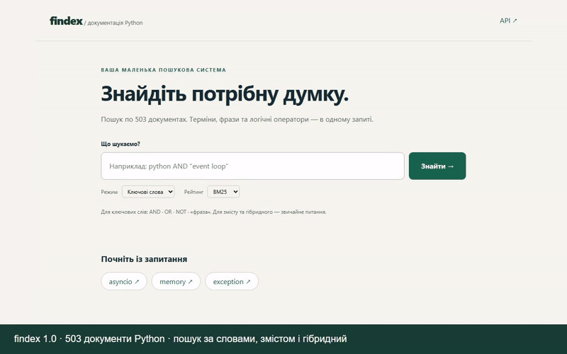
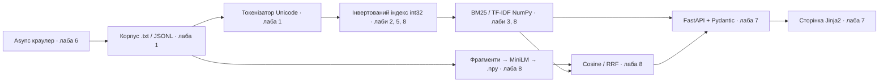

# findex

Невелика пошукова система по документації Python: від лінивого читання текстів до NumPy, семантичного пошуку й вебсторінки.

**[Відкрити пошук](https://findex-lab07.onrender.com/) · [Відеодемо, 2:30](docs/media/demo.mp4) · [API](https://findex-lab07.onrender.com/docs)**

**503 документи / 10.78 МіБ · p95 6113.5 мс · найбільше прискорення скорера 8.28×**



[](https://github.com/lev1pes/lab-01/actions/workflows/ci.yml)

Версія **1.0.0**, теги **lab-08** і **v1.0.0**. p95 виміряно на Render Free
за concurrency=20; прискорення — локальний scoring-only BM25 на частому слові,
не прискорення всього сайту. Відео — запис реального сервісу з титрами,
без голосової доріжки; темп змонтовано до 2:30. Free-сервіс після простою може
прокидатися: перед демонстрацією відкрийте його заздалегідь.

## Спробувати

- **Ключові слова:** `python AND "event loop"`, фрази, дужки, AND/OR/NOT; BM25 або TF-IDF.
- **За змістом:** звичайне англійське питання, наприклад `how to save objects and restore them later`.
- **Гібридний:** BM25 та семантичний рейтинг, злиті через RRF. Працює з вільним текстом, не з Boolean-фільтрами.

## Встановлення й запуск

Потрібен Python 3.12+ та uv. Для семантичного модуля і Docker використано Python 3.12.

```bash
git clone https://github.com/lev1pes/lab-01.git
cd lab-01
uv sync --locked --extra semantic
uv run python scripts/download_corpus.py
uv run findex index data/python-docs --out data/web-index.json --positions --executor serial
uv run findex embed data/web-index.json --out data/embeddings --model-cache .model-cache
uv run findex search data/web-index.json 'python async await' --k 5
uv run findex search data/web-index.json 'how to save objects' --mode hybrid --embeddings data/embeddings --model-cache .model-cache
```

`embed` показує прогрес і зберігає пакети в `.parts`: повторний запуск продовжує
розрахунок. Модель MiniLM завантажується з відкритого джерела; власний корпус не
надсилається в зовнішній API. `data/`, `.model-cache/` і локальний `.env` не комітяться.

PowerShell:

```powershell
$env:INDEX_PATH = 'data/web-index.json'
$env:EMBEDDINGS_PATH = 'data/embeddings'
$env:MODEL_CACHE = '.model-cache'
uv run findex serve --port 8000
```

У Linux/macOS ті самі змінні задаються через `export`. Відкрийте localhost:8000.
Без semantic-extra й EMBEDDINGS_PATH працює keyword; semantic/hybrid тоді повертають
зрозумілий 503. Встановлення команди у PATH: `uv tool install '.[semantic]'`.

## Шлях даних



CLI, пакування, типи й тести — лабораторна 4. Ресурси завантажуються раз на процес
через lifespan; HTTP-пошук — def у пулі потоків. Кожен процес має свою модель та
індекс. ONNX виконує один запит моделі за раз у worker; BLAS/ONNX обмежені за потоками.

## Що змінила лабораторна 8

1. **Спочатку профіль:** [план до правок](docs/profiles/plan-before.md),
   [flame graph пошуку](docs/profiles/before-search.svg),
   [індексації](docs/profiles/before-index.svg), [сирі профілі](benchmarks/lab08).
   [Висновки після змін і баг GIL](docs/profiles/outcomes.md).
   Вузькі місця: load/validate, нормалізація й снипети. Scalene окремо оцінює
   Python/native/system; його sampled числа не є точним виміром кожної інструкції.
2. **NumPy:** два масиви int32 на постінги, int32-масив довжин; float64 для скорерів.
   BM25/TF-IDF рахуються над масивами. `argpartition` вибирає top-k; рівні бали
   стабільно впорядковуються за doc_id. Старі plain/slots/array та JSON залишено сумісними.
3. **Снипети:** Unicode-сканування через regex, обмежений кеш 8192 нормалізованих
   словоформ; короткі regex-збіги не відпускають GIL, щоб уникнути зайвих
   перемикань між HTTP-потоками. Повний прогрітий top-10: **203.48 → 47.04 мс (4.33×)**.
4. **Семантика:** all-MiniLM-L6-v2 через FastEmbed/ONNX, 384 координати,
   11 273 фрагменти по 160 слів із перекриттям 32. L2-нормалізація, `E @ q`,
   максимум по фрагментах документа. RRF: `sum(1 / (60 + rank))`.
   SHA-256 корпусу не дозволяє підставити ембеддинги від іншого індексу.

### Скорер без диска та снипетів

| Скорер | Запит | Збігів | Python, мс | NumPy, мс | Прискорення |
|---|---|---:|---:|---:|---:|
| bm25 | `python` | 403 | 0.8403 | 0.1015 | 8.28× |
| bm25 | `aaaaaa` | 1 | 0.0147 | 0.0615 | 0.24× |
| bm25 | `python async await` | 29 | 0.4566 | 0.1394 | 3.28× |
| tfidf | `python` | 403 | 0.6813 | 0.0959 | 7.10× |
| tfidf | `aaaaaa` | 1 | 0.0135 | 0.0634 | 0.21× |
| tfidf | `python async await` | 29 | 0.3764 | 0.1043 | 3.61× |


Медіана 21 повтору після прогріву. На одному постінгу NumPy **повільніший** через
накладні витрати. [Усі таблиці лабораторних 1–8, методики та розкид](docs/measurements.md).

### Precision@5

| Запит | Keyword P@5 | Semantic P@5 | Hybrid P@5 |
|---|---:|---:|---:|
| `"event loop"` | 0.60 | 0.40 | 0.60 |
| `dataclass OR dataclasses` | 0.60 | 0.40 | 0.60 |
| `pickle OR serialization` | 0.40 | 0.60 | 0.40 |
| `generator OR yield` | 0.60 | 0.40 | 0.40 |
| `pathlib OR paths` | 0.40 | 0.40 | 0.40 |
| `"regular expression" OR regex` | 0.40 | 0.60 | 0.60 |
| `dictionary OR hashing` | 0.00 | 0.40 | 0.40 |
| `"context manager"` | 0.20 | 0.40 | 0.40 |
| `decorator OR decorators` | 0.40 | 0.20 | 0.40 |
| `heapq OR heap` | 0.20 | 0.40 | 0.40 |
| `reviving possessions` | 0.00 | 0.00 | 0.00 |
| `collaborative multitasking` | 0.00 | 0.20 | 0.00 |
| `automated boilerplate` | 0.00 | 0.00 | 0.00 |
| `hierarchical navigation` | 0.00 | 0.00 | 0.00 |
| `disposal guardians` | 0.00 | 0.00 | 0.00 |
| **Середнє, 15 запитів** | **0.253** | **0.293** | **0.307** |


На цій вибірці середнє P@5: keyword **0.253**, semantic **0.293**, hybrid **0.307**.
Semantic покращив `dictionary OR hashing` (0 → 0.4) і контекстні менеджери
(0.2 → 0.4), але погіршив генератори (0.6 → 0.4). На п'яти перефразуваннях
keyword та hybrid мають 0; semantic знаходить ціль лише для `collaborative multitasking`.
Отже, RRF трохи підняв загальне середнє, але не виправив складні перефразування.
Це невеликий і обмежений виграш, а не універсальне розуміння запитів.

Розмітка маленька й неповна. Останні п'ять запитів мають лише один позначений
цільовий документ, отже їхній максимум P@5 — 0.2. Нуль означає, що ціль не потрапила
в top-5, а не що весь результат беззмістовний. Детальні шляхи —
[evaluation.json](benchmarks/lab08/evaluation.json). Семантика і RRF не гарантують
виграш на кожному запиті; точні технічні назви часто краще знаходить BM25.

## Перевірка та відтворення

```bash
uv run ruff check .
uv run ruff format --check .
uv run pyright
uv run pytest --benchmark-disable --cov=findex
uv run python scripts/benchmark_final.py
uv run pytest tests/test_performance_semantic.py -k benchmark --benchmark-only
```

**443 тести, покриття з гілками 93.31%, pyright strict.** CI перевіряє 3.12 та
3.13t, wheel у чистому оточенні, Docker у ліміті 512 МіБ і performance.
pytest-benchmark зберігає базу окремо для кожної моделі CPU; наступний падає при регресії
медіани понад 50%. Intel і AMD runner не порівнюються між собою. Спільний runner може шуміти — причину такого сигналу слід перевіряти.
У тестах немає мережі/завантаження моделі: fake encoder перевіряє математику,
а реальна MiniLM окремо перевірена таблицею. Поза coverage — браузер, хостинг,
профіліровщики й код самої моделі.

## Деплой

```bash
docker build -t findex:1.0.0 .
docker run --rm -p 8000:8000 -e INDEX_PATH=/app/data/web-index.json findex:1.0.0
```

Два етапи Docker, uv.lock, непривілейований користувач findex. Індекс і модель
готуються під час build, у runtime модель читається офлайн. README не входить до
ключа Docker-шару з моделлю: редагування таблиці не запускає ембеддинг заново.
На локальній Windows Docker не встановлений; реальний контейнер перевірено
в GitHub Actions і Render. Health check — `/health`. Розгортання виконується явно
через Render API після Git push; ключ не входить у репозиторій.

## Обмеження

- Модель англомовна; якість українських і російських питань не гарантовано.
- MiniLM обрізає вхід до 256 wordpiece-токенів; 160 слів не завжди вміщуються.
- Векторний пошук перебирає всі фрагменти. Для мільйонів потрібен ANN, наприклад HNSW.
- Індекс і тексти живуть у RAM, при кількох workers дублюються. Старі словникові
  представлення довжин збережено для сумісності; NumPy-масив використовується в scoring.
- P@5 тут не репрезентативний промисловий тест. Free Render має холодний старт і слабкий CPU.
- Pickle читати лише зі своїх довірених файлів. `.npy` завантажується з allow_pickle=False.
- Відео з титрами готове; вимогу озвучення власним голосом слід завершити самостійно.

## Де читати код

`corpus.py` / `tokenize.py` → `models.py` / `index.py` / `parallel.py` →
`query.py` / `scoring.py` / `vector.py` / `semantic.py` → `cli.py` / `web/`.
Зв'язок лабораторних збережено в тегах lab-01…lab-08.

[Умова лабораторної 8](https://github.com/rmalkevy/Programming-Practice-Projects/blob/main/courses/python/lab-08-performance-and-semantic-search.md) ·
[FastEmbed](https://qdrant.github.io/fastembed/Getting%20Started/) ·
[NumPy broadcasting](https://numpy.org/doc/stable/user/basics.broadcasting.html) ·
[Scalene](https://github.com/plasma-umass/scalene)
